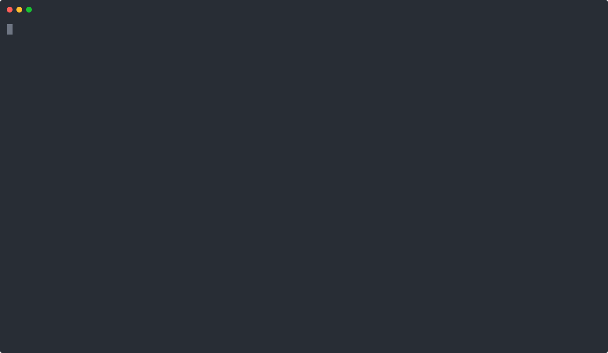
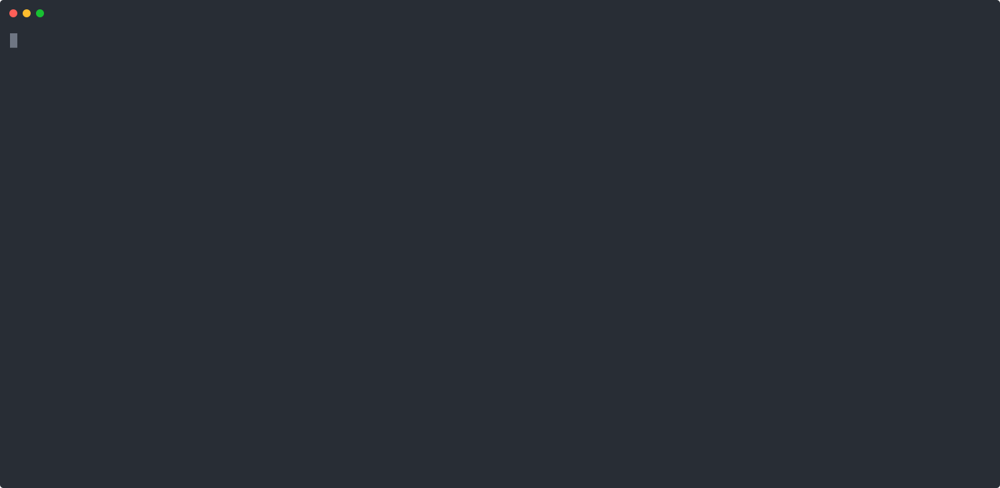

# SimTest


**Fuzz testing and coverage reporting for LLM agents.**

SimTest is a zero-config test harness for validating multi-step LLM agents built with CrewAI, LangGraph, or custom DAGs.

It loads your agent graph, generates deterministic seed inputs, runs them in a controlled sandbox, and produces detailed cost/latency/failure/coverage reports. Ideal for teams that ship LLM agents in production and want CI-grade reliability.

---

## Installation

Install via PyPI:

```bash
pip install simtest
```

Or clone the repository directly:

```bash
git clone https://github.com/sohomx/simtest.git
cd simtest
pip install .
```

---

## Quick Start – 3 commands

```bash
pip install -e .                            # 1️⃣ editable install for fast iteration
simtest init --path examples/basic_agent/main.py   # 2️⃣ parse agent & write .simgraph.json
# Or, import from trace:
simtest init --trace path/to/trace.json
simtest fuzz --quick                        # 3️⃣ 100 seeds, <60 s, < $1
```
---

## ✅ Why SimTest?

## 👤 Who is SimTest for?

- AI infra engineers shipping DAG-style agents to production
- Fintech, med-tech, and policy-sensitive teams with tight reliability constraints
- Builders who want CI-grade enforcement of agent cost, schema, and coverage

SimTest is built for reliability-focused teams shipping multi-step LLM agents into production.

It gives you:

- Deterministic test graph from your agent code
- Curated and generated seed suites with metadata
- Cost/latency-aware fuzzing with CI gates
- Markdown and Slack-friendly reports for visibility

### ✅ Supported Integrations:
- LangGraph
- CrewAI
- Workflows traces (`workflow_version`)
- AutoGen OTEL traces

---

## What happens under the hood

1. **Editable install**

   Links your working directory into the Python environment. Any code edits are picked up instantly without reinstalling the package.

2. **`simtest init`**

   Parses your agent file (`main.py`, LangGraph/CrewAI/Python DAG) and builds a `.simgraph.json` file:

   * Lists all nodes and their tool schemas
   * Ensures graph structure is deterministic and reproducible
   * Used as the input for later test runs

3. **`simtest fuzz --quick`**

   Runs a default 100 curated seed cases in a sandboxed executor:

   * Tracks cost, latency, and verdict per node
   * Validates schema correctness and catches exceptions
   * Warns if coverage <80% (nodes or tool schemas)
   * Enforces a budget cap (`--max-cost $3` by default)
   * Can optionally emit a markdown report (`--report report.md`)

---

### 📽 Terminal Demo

This demo shows importing a trace, running fuzz, and generating a report:



This runs the core workflow:

```bash
simtest init --path examples/basic_agent/main.py
simtest seed --suite tool-schema-sanity
simtest fuzz --quick --report simtest-report.md
```

It parses the agent DAG, loads curated test seeds, runs sandboxed fuzz checks, and writes a markdown report — all under 30 seconds.

---

## CLI Commands

### `simtest init`

Parse agent file:

```bash
simtest init --path path/to/your_agent.py
```

Or, import from trace:

```bash
simtest init --trace path/to/trace.json
```

### `simtest seed`

Copies a curated seed pack:

```bash
simtest seed --suite tool-schema-sanity
```

You can also generate LLM-based seeds:

```bash
simtest generate --suite analyze --n 100
```

### `simtest import`

Converts LangSmith run JSON into `.simgraph.json` + test seeds.

```bash
simtest import langsmith your_run.json
```

Generates:
- `.simgraph.json` – linear trace DAG
- `seeds/trace-import.yaml` – one seed per LangSmith step

---

### `simtest fuzz`

Runs curated test seeds in sandbox and applies schema, policy, cost, and exception checks:

```bash
simtest fuzz --suite tool-schema-sanity --quick --max-cost 3.0 --report simtest-report.md
```

Optional flags:

- `--semantic-check` (use LLM to classify failed outputs + policy violations)
- `--soft-policy` (treat FAIL_POLICY as warning, not CI fail)
- `--max-per-node` (trigger FAIL_COST_SPIKE if exceeded)
- `--report` (write markdown summary)
- `--trace-log` (write full step trace as JSON)

---


## Output Example




A markdown report (if `--report path.md` is provided) includes:

* Table of failed seeds (seed id, verdict, latency, explanation)
* Top 5 costliest nodes
* Total cost, runtime, and coverage stats

## 🧭 Feature Matrix

| Feature                   | CLI Support                   | CI Gate | Docs |
|---------------------------|-------------------------------|---------|------|
| Tool schema validation    | ✅ `fuzz`                      | ✅      | ✅    |
| Exception detection       | ✅ `fuzz`                      | ✅      | ✅    |
| Cost spike detection      | ✅ `--max-per-node`            | ✅      | ✅    |
| Policy violation detect   | ✅ `--semantic-check`          | ✅      | ✅    |
| Markdown report           | ✅ `--report`                  | ✖️       | ✅    |
| Slack alert webhook       | ✅ `simtest notify`            | ✖️       | ✅    |

---

## 🧪 Seed Packs

SimTest comes with curated seed suites for key failure modes:

| Suite             | Purpose                          | # Seeds | Cost Mult | Noise Cap |
|------------------|----------------------------------|---------|-----------|------------|
| tool-schema-sanity | Detect schema mismatches         | 100     | 1.0       | 10%        |
| policy-violation   | Test moderation / unsafe prompts | 5       | 1.0       | 20%        |
| long-context       | Trigger truncation & overflow    | 5       | 1.0       | 20%        |

Each `.yaml` includes metadata like `cost_multiplier` and `noise_threshold`.

---

## CI Integration

To enforce test gates on pull requests, add this GitHub Action:

```yaml
# .github/workflows/simtest.yml
name: SimTest CI

on: [push, pull_request]

jobs:
  simtest:
    runs-on: ubuntu-latest
    steps:
      - uses: actions/checkout@v3
      - uses: actions/setup-python@v4
        with:
          python-version: "3.10"
      - run: pip install .
      - run: simtest fuzz --quick --report simtest-report.md
```

To detect regressions:

- Fails if noise > threshold (e.g., >10%)
- Fails if total cost > 10% increase
- Fails on schema, exception, or cost spike errors
- Fails on policy if not using `--soft-policy`

---


## License

MIT License.

---

## Maintainers

SimTest is maintained by reliability engineers building mission-critical LLM workflows. Contributions are welcome.
